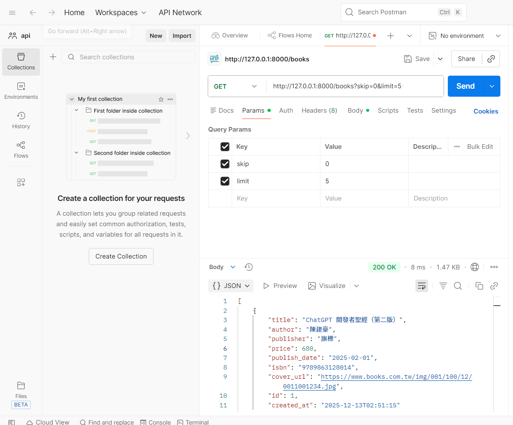
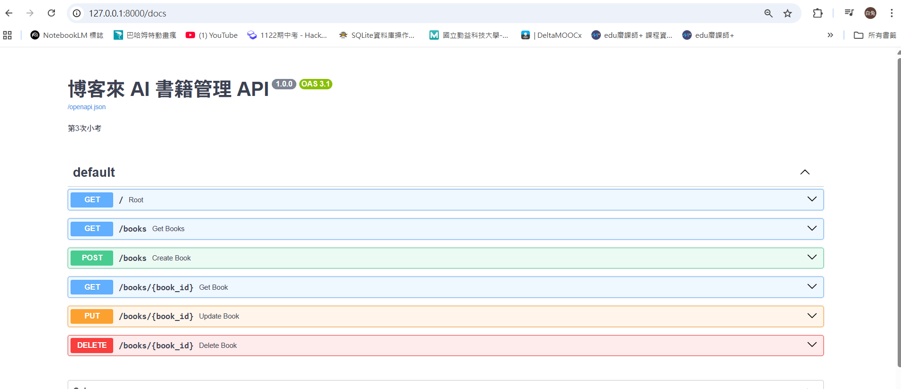
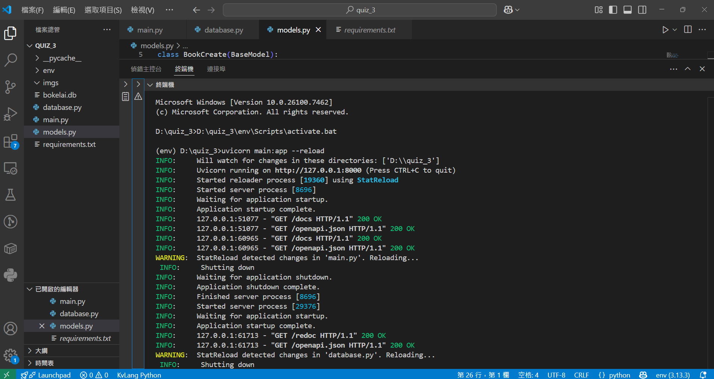

# ai-books-api

博客來 AI 書籍管理 API

## 圖片展示

### Postman API 測試流程
| DELETE | GET | POST |
| :---: | :---: | :---: |
|  |  |  |

### 系統文件與啟動畫面
| ReDoc 文件畫面 | Swagger 文件畫面 | 啟動範例畫面 |
| :---: | :---: | :---: |
|  |  |  |