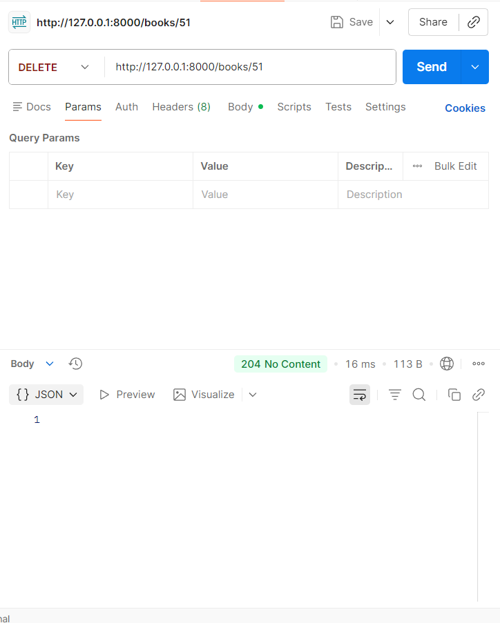
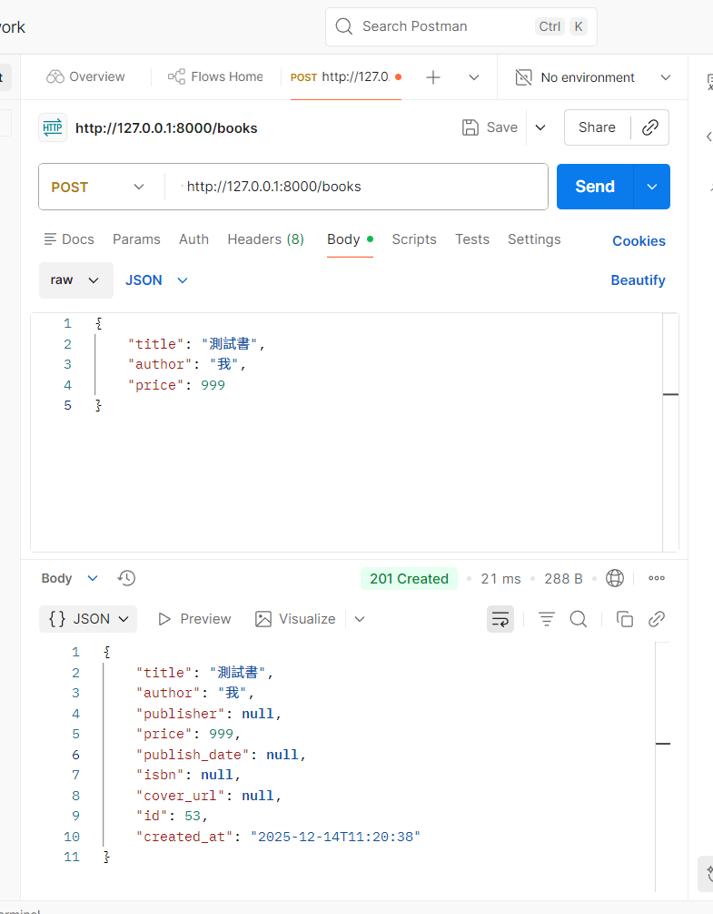
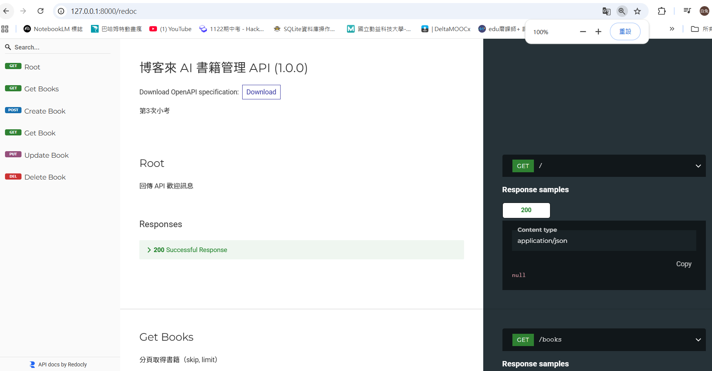

# ai-books-api
博客來 AI 書籍管理 API

## 圖片
以下為 imgs 目錄下的所有圖片展示：

<!-- IMAGES_GALLERY_START: 以下內容會被填入 imgs 目錄內的所有圖片 -->

  <figure style="margin:0;">
    
    <figcaption style="font-size:12px;color:#555;padding:6px 4px;text-align:center;">Postman 測試 — DELETE</figcaption>
  </figure>
  <figure style="margin:0;">
    
    <figcaption style="font-size:12px;color:#555;padding:6px 4px;text-align:center;">Postman 測試 — GET</figcaption>
  </figure>
  <figure style="margin:0;">
    
    <figcaption style="font-size:12px;color:#555;padding:6px 4px;text-align:center;">Postman 測試 — POST</figcaption>
  </figure>
  <figure style="margin:0;">
    
    <figcaption style="font-size:12px;color:#555;padding:6px 4px;text-align:center;">ReDoc 文件畫面</figcaption>
  </figure>
  <figure style="margin:0;">
    
    <figcaption style="font-size:12px;color:#555;padding:6px 4px;text-align:center;">啟動範例畫面</figcaption>
  </figure>
  <figure style="margin:0;">
    
    <figcaption style="font-size:12px;color:#555;padding:6px 4px;text-align:center;">Swagger 文件畫面</figcaption>
  </figure>

<!-- IMAGES_GALLERY_END -->
